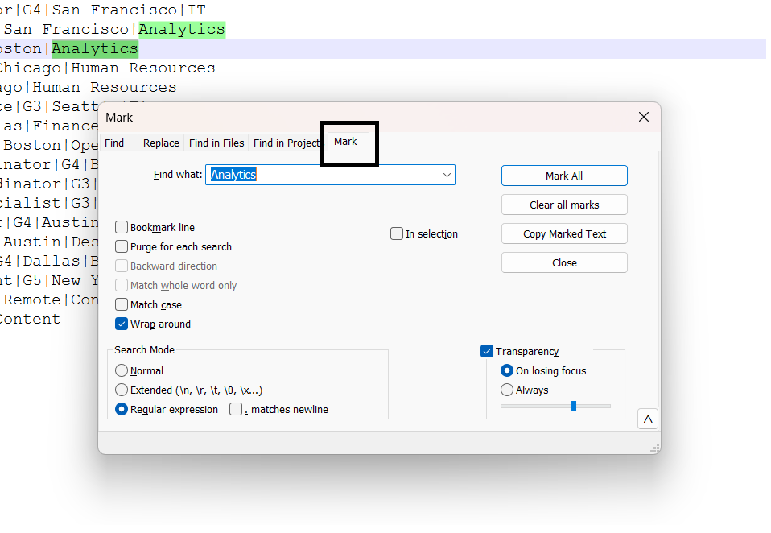

# Notepad++ : Power of mark and select

Ever had a huge text file with delimited data and you had to copy only those lines that had a specific word?

Notepad++ has got your back, its mark and select feature is a boon in disguise for copying, cutting and selecting those lines that have a very specific selection criteria.
Let's get right into an example.

## Selecting employee's in the same department

The following text file contains a list of pipe seperated details of employee's of a company like the job role, position, department, etc:

        Employee_Name|Employee_Number|Job|Grade|Location|Department
    John Smith|1001|Software Engineer|G5|New York|IT
    Sophia Martinez|1002|DevOps Engineer|G5|Denver|IT
    Emily Chen|1003|System Administrator|G4|San Francisco|IT
    Alice Johnson|1004|Data Analyst|G4|San Francisco|Analytics
    David Kim|1005|Data Scientist|G5|Boston|Analytics
    Michael Lee|1006|HR Specialist|G3|Chicago|Human Resources
    Sarah Clark|1007|Recruiter|G3|Chicago|Human Resources
    Olivia Wilson|1008|Finance Associate|G3|Seattle|Finance
    Liam Foster|1009|Accountant|G4|Dallas|Finance
    Emma Davis|1010|Project Manager|G6|Boston|Operations
    Alex Roberts|1011|Operations Coordinator|G4|Boston|Operations
    James Anderson|1012|Marketing Coordinator|G3|Los Angeles|   Marketing
    Laura Taylor|1013|Social Media Specialist|G3|Remote|Marketing
    William Brown|1014|Product Designer|G4|Austin|Design
    Sophia Green|1015|UX Researcher|G4|Austin|Design
    Liam Thomas|1016|Business Analyst|G4|Dallas|Business    Development
    Chloe White|1017|Strategy Consultant|G5|New York|Business   Development
    Mia Jackson|1018|Content Writer|G2|Remote|Content
    Chris Evans|1019|Editor|G3|Remote|Content

The requirement is to only copy the lines that contain details of employee's working in department Analytics.
Follow the below steps to achieve this in notepad++:

1. Click on Ctrl + M, the mark window pop's open in notepad++:
   
